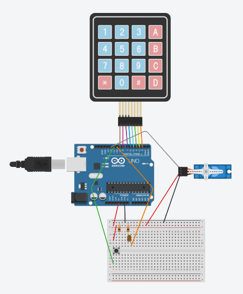

# ArduinoDoorLock

A simple Arduino Door Lock using a Keypad and a MicroServo and a Door Hook Lock

## Code

The code is pretty straightfoward, it sets up the Keypad and Servo with their libraries and all the standard stuff, then it listens to the button and the keypad. There are some instructions you can change at the top, mostly, to customize at your will, like the master password and its length in these lines, as it is commented in the code:

```c
#define PASSWORDLENGTH 4  //change this for longer or shorter passwords

const char definedPassword[PASSWORDLENGTH + 1] = "1111";  //change this to change the required password
```

Also, down into the **loop function**, the first few lines are a commented block that you can uncomment to manually test servo positions using serial input. Those results can be used to change the **#define** lines in the top of the code to match your best settings:

```c
#define LOCKEDPOSITION 60
#define UNLOCKEDPOSITION 0
```

## Usage

That said, the code works by waiting for input from the button or the Keypad. The button is meant to stay on the inside of the door, as it is a switch for locking and unlocking. The Keypad will fill a array of determined length that must match to a determined string. After inputing the opening code, the button **A** in the Keypad must be pressed for validation and unlocking the door. Inputing more characters than the limit will make the cursor loop. That means when pressing more than 4 digits (limit by default) the program will start typing at the beginning of the array again. The **B** button works like the Backspace key; the **C** button simply clears the typed characters; and the **D** button let's you lock the door from the outside. Also, every button press makes the led blink. When it's on, it means the door is locked. When it's off, the door is unlocked. 

## Circuit

The circuit that must be build for the code to run is in here:



*Circuit rendered on [Tinkercad](http://www.thinkercad.com)*

The Servo has a Door Hook attached to it, and its movement is responsible for setting the hook positions where it is locked and unlocked.

## Finally
First of all, thanks for reading this far. I hope this project can be useful to you somehow. I aim to make changes on this project, like using a better lock or recognition system, and this rep is going to be updated if so.